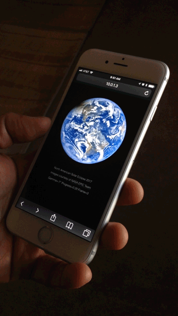

Tilt Sprite
====

This prototype tests the JavaScript `deviceorientation` event to see how the accelerometer might be used in mobile web apps. It uses the tilt of the device to control the motion of an animation sprite.

Run `grunt` to build the project. Deployable build is in /builds/dev/.

[Live Demo](https://emiliopassi.com/lab/tilt-sprite/)

Images courtesy of [NASA EPIC Team](https://epic.gsfc.nasa.gov/)
